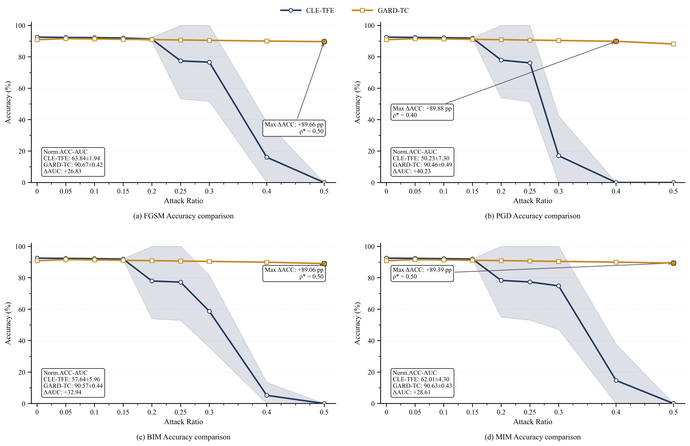
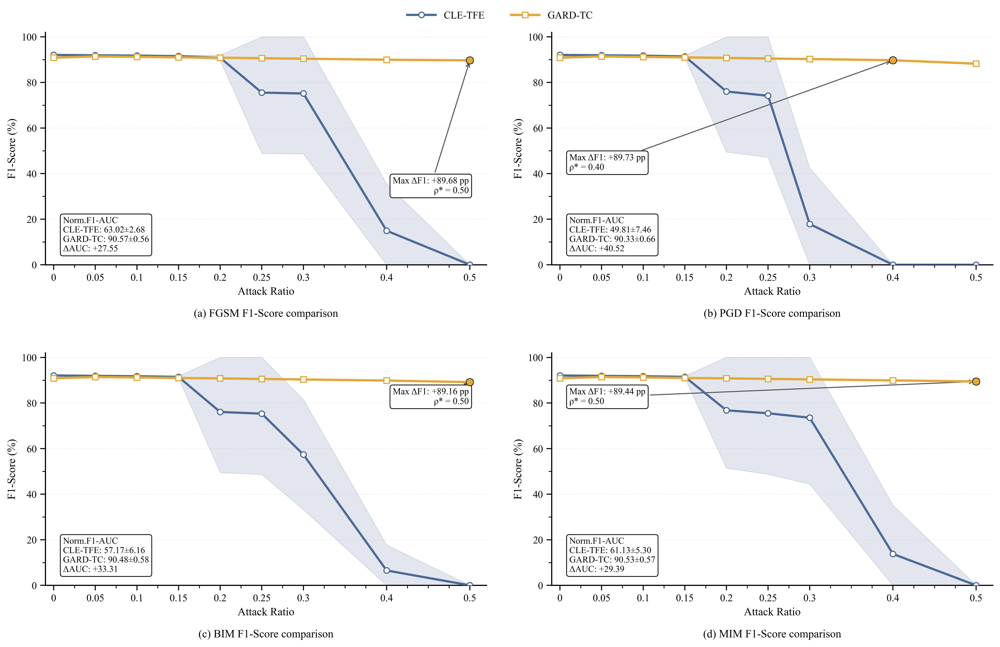
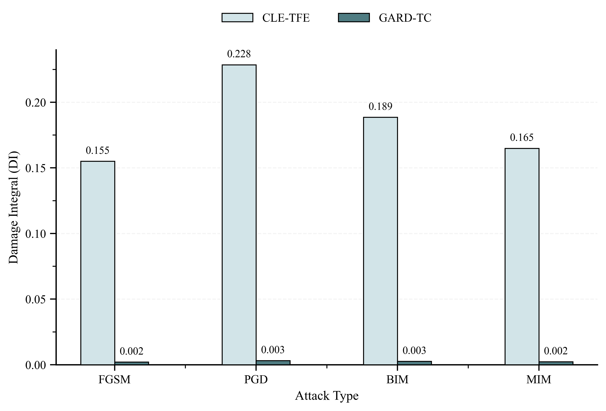
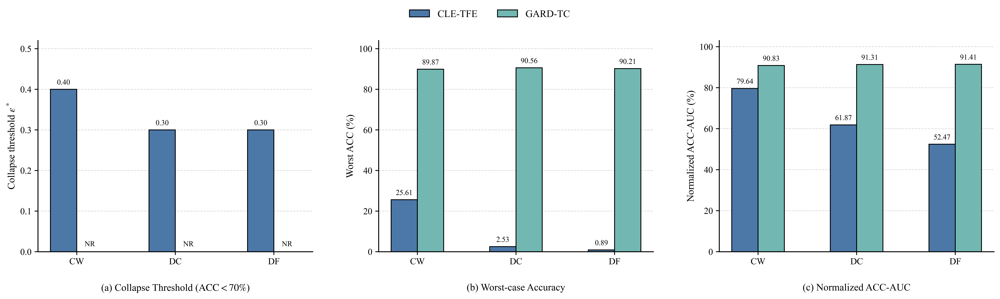
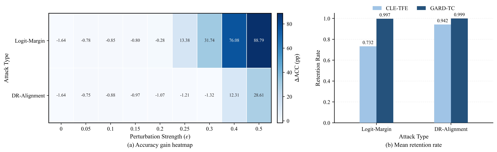
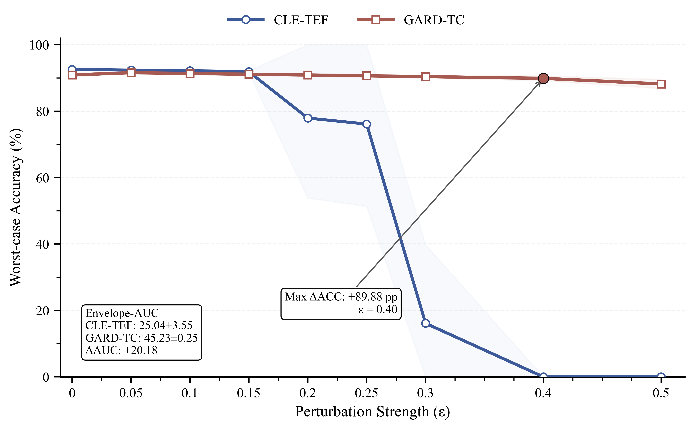
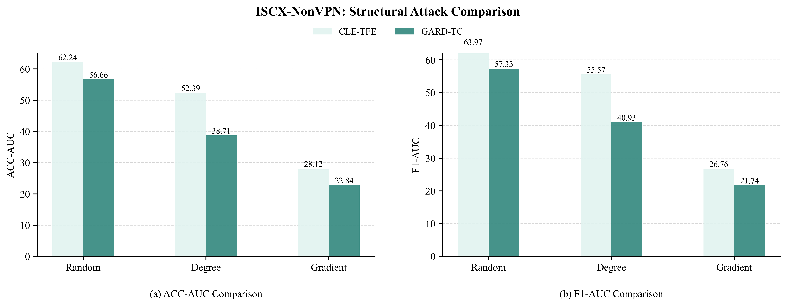

E.Multi-Attack Evaluation of Decision-Level Robustness

1) Robustness Analysis under Gradient-Step Attacks

​	Fig.1. Comparison under Gradient-Based Attacks(3 runs) 

​	Fig.2. Comparison under Gradient-Based Attacks(3 runs) 	

​	Fig.3. Cumulative Damage Comparison(3 runs) 

2.Robustness Analysis under Optimization-Based  Decision Boundary Attacks 

​	Fig.4. Robustness Comparison under Optimization-Based  Boundary Attacks(3 runs)

3.Robustness Analysis under Discriminative-Space  Attacks

​	Fig.5. Robustness Comparison under Discriminative-Space Attacks(3 runs)

4.Overall Robustness Analysis

​	Fig.6.Robustness Envelope under Multiple Attacks(3 runs)

F. Analysis of the Decision-Level Enhancement Mechanism 

​	TABLE I Decision-Level Ablation Experiments of EXP1-EXP4(3 runs)

| EXP.  |      EXP1      |   EXP1    |   EXP1    |    EXP2    | EXP2  |      EXP3      |   EXP3    |    EXP4    | EXP4  |
| :---: | :------------: | :-------: | :-------: | :--------: | :---: | :------------: | :-------: | :--------: | :---: |
| Meric |      Mean      |   Best    | Baseline  |    Mean    | Best  |      Mean      |   Best    |    Mean    | Best  |
|  ACC  | **92.53±0.20** |   92.46   | **95.54** | 91.67±0.25 | 91.96 |   92.38±0.15   |   92.50   | 91.88±0.11 | 91.92 |
|  PRE  | **92.96±0.12** | **93.05** |   90.09   | 91.38±1.14 | 91.94 |   92.64±0.63   |   91.95   | 91.51±1.26 | 92.68 |
|  REC  | **92.53±0.20** |   92.46   |   90.19   | 91.67±0.25 | 91.96 |   92.38±0.15   | **92.50** | 91.88±0.11 | 91.92 |
|  F1   |   92.08±0.30   | **92.13** |   89.94   | 91.03±0.39 | 91.66 | **92.26±0.29** |   91.96   | 91.45±0.19 | 91.61 |

​	Fig.7. Decision-Level Ablation under FGSM Attack(3 runs) 

​	Fig.8. Decision-Level Ablation under PGD Attack(3 runs) 

G. Analysis of the Auxiliary Role of Structure-Aware  Augmentation 

​	TABLE II Comparison of Four Evaluation Metrics among EXP1, EXP4, and EXP5(3 runs)

| EXP.  |       EXP1       |   EXP1    |   EXP1    |     EXP4     | EXP4  |     EXP5     | EXP5  |
| :---: | :--------------: | :-------: | :-------: | :----------: | :---: | :----------: | :---: |
| Meric |       Mean       |   Best    | Baseline  |     Mean     | Best  |     Mean     | Best  |
|  ACC  | **92.53 ± 0.20** |   92.46   | **95.54** | 91.88 ± 0.11 | 91.92 | 90.89 ± 0.41 | 91.29 |
|  PRE  | **92.96 ± 0.12** | **93.05** |   90.09   | 91.51 ± 1.26 | 92.68 | 91.93 ± 1.06 | 91.58 |
|  REC  | **92.53 ± 0.20** | **92.46** |   90.19   | 91.88 ± 0.11 | 91.92 | 90.89 ± 0.41 | 91.29 |
|  F1   | **92.08 ± 0.30** | **92.13** |   89.94   | 91.45 ± 0.19 | 91.61 | 90.85 ± 0.37 | 91.29 |

​	Fig.9. FGSM Attack after Optimizing the Node  Dropping Algorithm(3 runs) 

​	Fig.10. PGD Attack after Optimizing the Node Dropping

​	Fig.11. Structural Attack Results before and after  Optimization(3 runs)