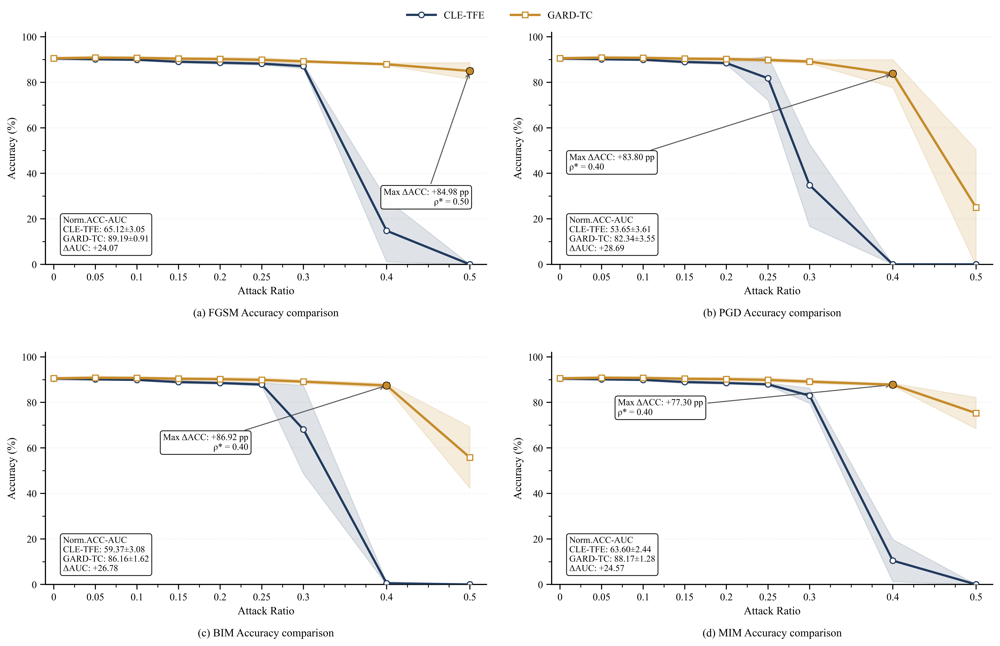
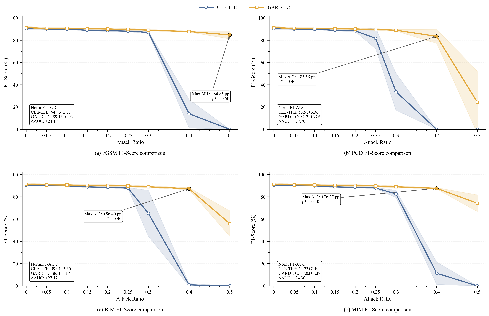
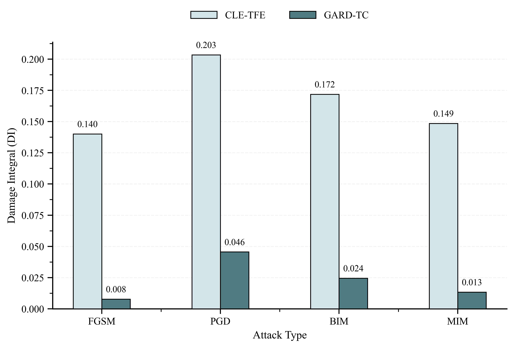
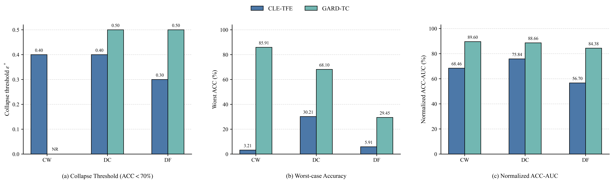
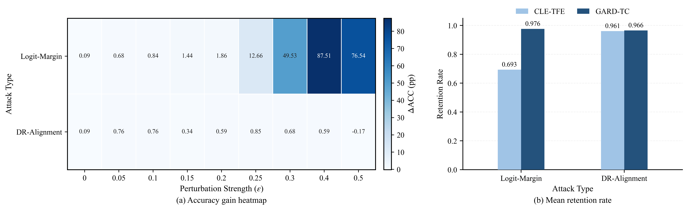
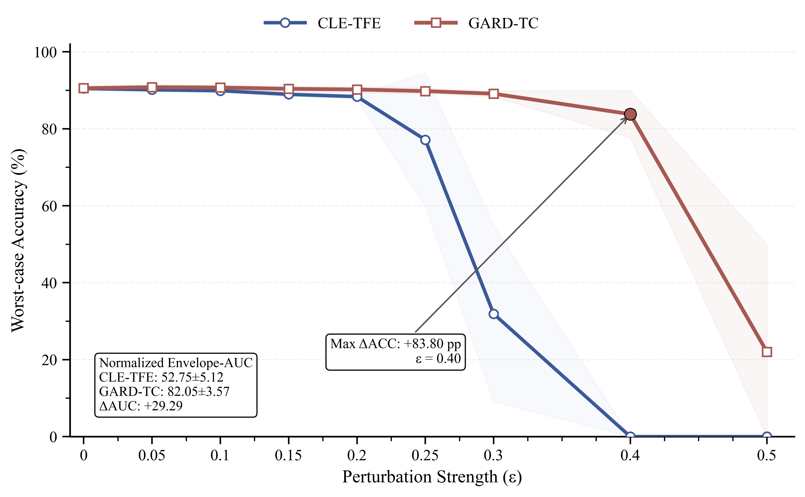
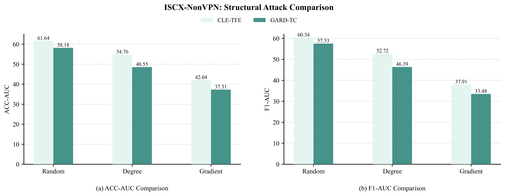

E.Multi-Attack Evaluation of Decision-Level Robustness

1) Robustness Analysis under Gradient-Step Attacks

​	Fig.1. Comparison under Gradient-Based Attacks(3 runs) 

​	Fig.2. Comparison under Gradient-Based Attacks(3 runs) 	

​	Fig.3. Cumulative Damage Comparison(3 runs) 

2) Robustness Analysis under Optimization-Based  Decision Boundary Attacks 

​	Fig.4. Robustness Comparison under Optimization-Based  Boundary Attacks(3 runs)

3) Robustness Analysis under Discriminative-Space  Attacks 

​	Fig.5. Robustness Comparison under Discriminative-Space Attacks(3 runs)

4) Overall Robustness Analysis

​	Fig.6.Robustness Envelope under Multiple Attacks(3 runs)

F. Analysis of the Decision-Level Enhancement Mechanism 

​	TABLE I Decision-Level Ablation Experiments of EXP1-EXP4(3 runs)

| EXP.  |      EXP1      | EXP1  |   EXP1    |    EXP2    | EXP2  |    EXP3    | EXP3  |    EXP4    | EXP4  |
| :---: | :------------: | :---: | :-------: | :--------: | :---: | :--------: | :---: | :--------: | :---: |
| Meric |      Mean      | Best  | Baseline  |    Mean    | Best  |    Mean    | Best  |    Mean    | Best  |
|  ACC  | **90.46±0.64** | 91.14 | **92.86** | 89.37±0.51 | 89.87 | 90.29±0.39 | 90.63 | 89.11±0.00 | 89.11 |
|  PRE  | **90.55±0.64** | 91.09 | **93.96** | 89.38±0.59 | 89.91 | 90.32±0.48 | 90.74 | 89.09±0.12 | 89.20 |
|  REC  | **90.46±0.64** | 91.14 | **93.91** | 89.37±0.51 | 89.87 | 90.27±0.43 | 90.63 | 89.11±0.00 | 89.11 |
|  F1   | **90.44±0.63** | 91.08 | **93.89** | 89.31±0.55 | 89.82 | 90.21±0.32 | 90.51 | 89.04±0.08 | 89.12 |

​	Fig.7. Decision-Level Ablation under FGSM Attack(3 runs) 

​	Fig.8. Decision-Level Ablation under PGD Attack(3 runs) 

G. Analysis of the Auxiliary Role of Structure-Aware  Augmentation 

​	TABLE II Comparison of Four Evaluation Metrics among EXP1, EXP4, and EXP5(3 runs)

| EXP.  |      EXP1      | EXP1  |   EXP1    |    EXP4    | EXP4  |      EXP5      | EXP5  |
| :---: | :------------: | :---: | :-------: | :--------: | :---: | :------------: | :---: |
| Meric |      Mean      | Best  | Baseline  |    Mean    | Best  |      Mean      | Best  |
|  ACC  |   90.46±0.64   | 91.14 | **92.86** | 89.11±0.00 | 89.11 | **90.55±0.53** | 91.14 |
|  PRE  | **90.55±0.64** | 91.09 | **93.96** | 89.09±0.12 | 89.20 |   90.50±0.53   | 91.08 |
|  REC  |   90.46±0.64   | 91.14 | **93.91** | 89.11±0.00 | 89.11 | **90.55±0.53** | 91.14 |
|  F1   |   90.44±0.63   | 91.08 | **93.89** | 89.04±0.08 | 89.12 | **90.47±0.53** | 91.06 |

​	Fig.9. FGSM Attack after Optimizing the Node  Dropping Algorithm(3 runs) 

​	Fig.10. PGD Attack after Optimizing the Node Dropping

​	Fig.11. Structural Attack Results before and after  Optimization(3 runs)