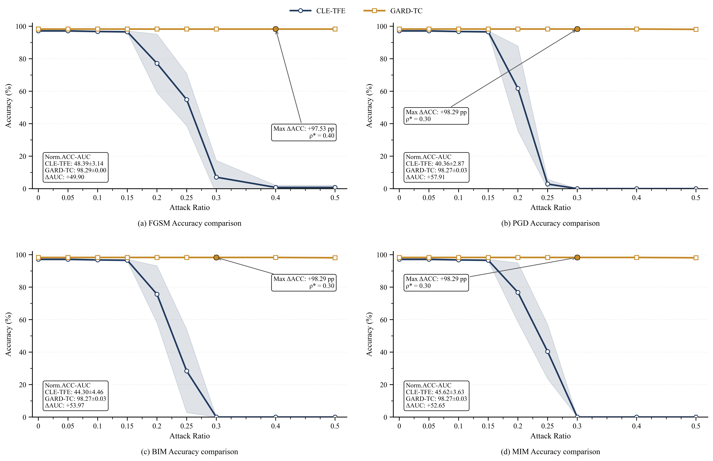
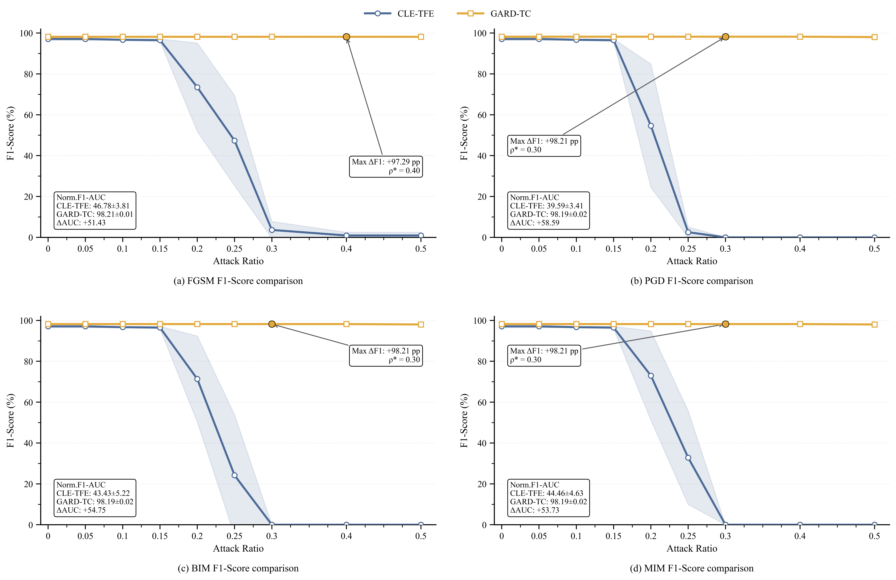
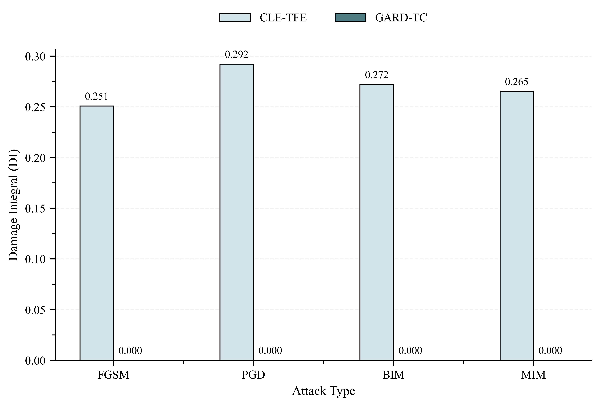
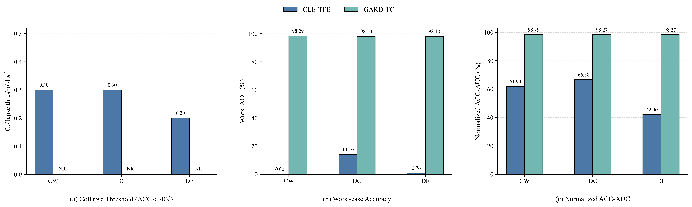
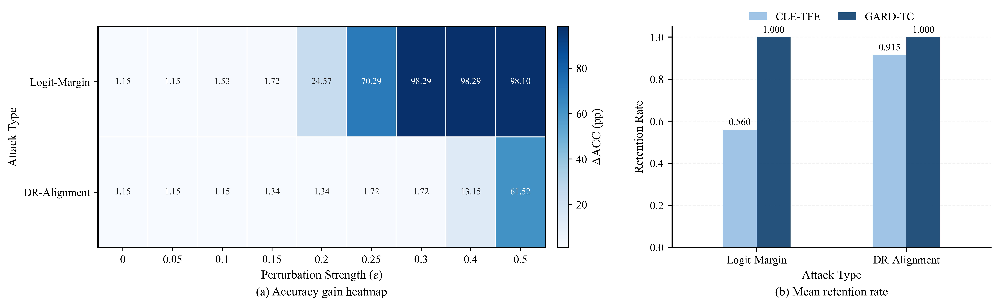
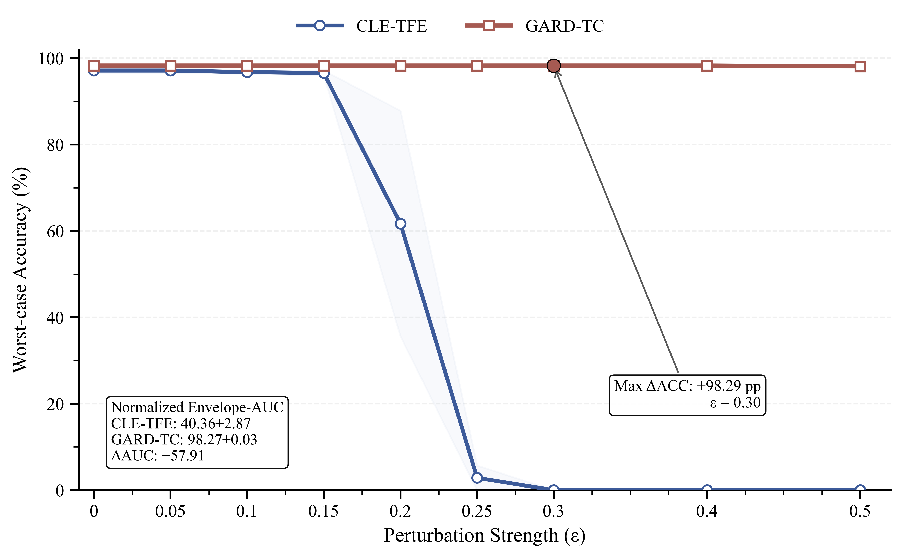
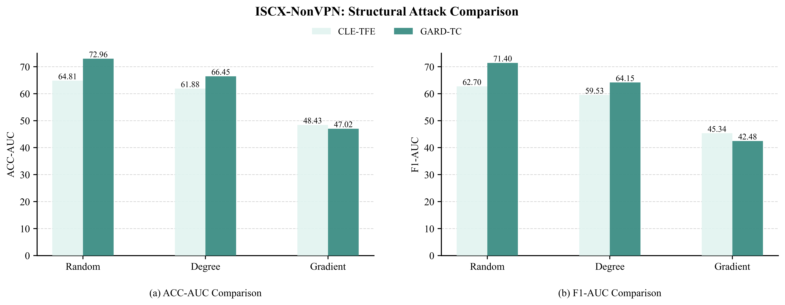

E.Multi-Attack Evaluation of Decision-Level Robustness

1) Robustness Analysis under Gradient-Step Attacks

Fig.1. Comparison under Gradient-Based Attacks(3 runs) 

​	Fig.2. Comparison under Gradient-Based Attacks(3 runs) 

​	

​	Fig.3. Cumulative Damage Comparison(3 runs) 

2.Robustness Analysis under Optimization-Based  Decision Boundary Attacks 

​	Fig.4. Robustness Comparison under Optimization-Based  Boundary Attacks(3 runs)

3.Robustness Analysis under Discriminative-Space  Attacks

​	Fig.5. Robustness Comparison under Discriminative-Space Attacks(3 runs)

4.Overall Robustness Analysis

​	Fig.6.Robustness Envelope under Multiple Attacks(3 runs)

F. Analysis of the Decision-Level Enhancement Mechanism 

​	TABLE I Decision-Level Ablation Experiments of EXP1-EXP4(3 runs)

| EXP.  |    EXP1    | EXP1  |   EXP1   |    EXP2    | EXP2  |      EXP3      | EXP3  |    EXP4    | EXP4  |
| :---: | :--------: | :---: | :------: | :--------: | :---: | :------------: | :---: | :--------: | :---: |
| Meric |    Mean    | Best  | Baseline |    Mean    | Best  |      Mean      | Best  |    Mean    | Best  |
|  ACC  | 97.14±0.57 | 97.71 | **100**  | 97.71±0.57 | 98.89 | **97.90±0.34** | 98.29 | 97.52±0.33 | 97.71 |
|  PRE  | 97.43±0.52 | 97.97 | **100**  | 98.09±0.35 | 98.40 | **98.04±0.31** | 98.40 | 97.72±0.20 | 97.86 |
|  REC  | 97.14±0.57 | 97.71 | **100**  | 97.71±0.57 | 98.29 | **97.90±0.34** | 98.29 | 97.52±0.33 | 97.71 |
|  F1   | 97.07±0.58 | 97.66 | **100**  | 97.69±0.53 | 98.20 | **97.81±0.34** | 98.20 | 97.44±0.31 | 97.62 |

​	Fig.7. Decision-Level Ablation under FGSM Attack(3 runs) 

​	Fig.8. Decision-Level Ablation under PGD Attack(3 runs) 

G. Analysis of the Auxiliary Role of Structure-Aware  Augmentation 

​	TABLE II Comparison of Four Evaluation Metrics among EXP1, EXP4, and EXP5(3 runs)

| EXP.  |    EXP1    | EXP1  |   EXP1   |    EXP4    | EXP4  |      EXP5      | EXP5  |
| :---: | :--------: | :---: | :------: | :--------: | :---: | :------------: | :---: |
| Meric |    Mean    | Best  | Baseline |    Mean    | Best  |      Mean      | Best  |
|  ACC  | 97.14±0.57 | 97.71 | **100**  | 97.52±0.33 | 97.71 | **98.29±0.00** | 98.29 |
|  PRE  | 97.43±0.52 | 97.97 | **100**  | 97.72±0.20 | 97.86 | **98.34±0.10** | 98.40 |
|  REC  | 97.14±0.57 | 97.71 | **100**  | 97.52±0.33 | 97.71 | **98.29±0.00** | 9829  |
|  F1   | 97.07±0.58 | 97.66 | **100**  | 97.44±0.31 | 97.62 | **98.21±0.01** | 98.20 |

​	Fig.9. FGSM Attack after Optimizing the Node  Dropping Algorithm(3 runs) 

​	Fig.10. PGD Attack after Optimizing the Node Dropping

​	Fig.11. Structural Attack Results before and after  Optimization(3 runs)